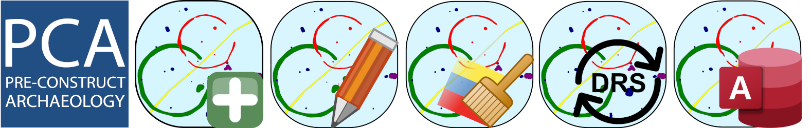

<h1>PCA Post-excavation QGIS Plugin</h1>

PCA Post-excavation is an internal QGIS Plugin specifically built for the PCA post-excavation phase.
	
It is a component of the new DRS/GIS integrated data management system, and provides a set of tool that help definings groups, entities, periods, sub-periods and phases for all the archeological features.
	  
